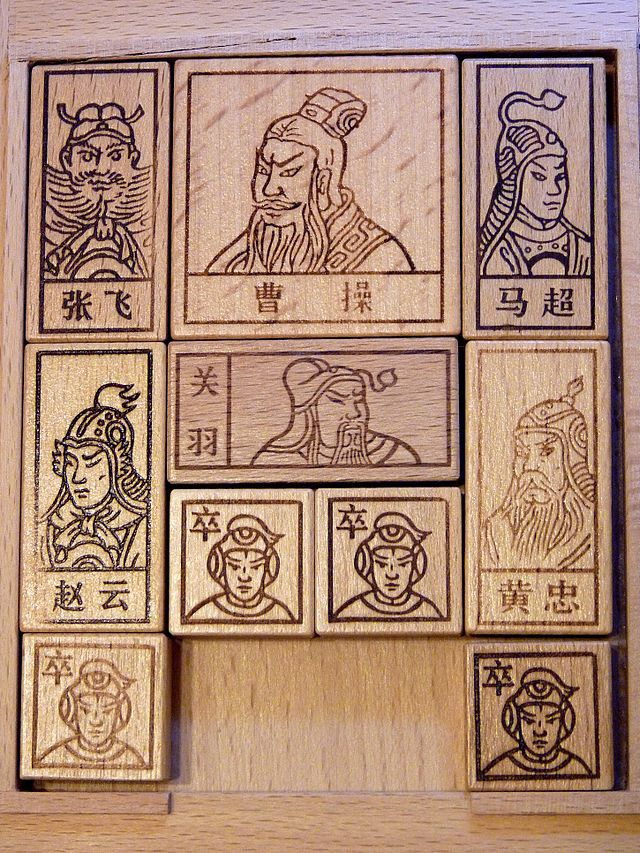

# CSC384-Intro-to-AI
Course AI projects, a lot of fun! 

# 1. Huarongdao

>The hrd file provides three input.txt files with uncompleted input file and the input3.txt is the classical 横刀立马.
>
>hrd.py provides the solver with A* and dfs algorithm. 
>
>run by "python3 hrd.py (input file) (DFS output file) (A* output file)" 
>
>(if "python3" does not work, try "py")
>
>ie "python3 hrd.py puzzle5.txt puzzle5sol_dfs.txt puzzle5sol_astar.txt"
>
>hrd.validate is a script to compare the generated output file with given solution files. There's no solution file for input3.txt, but the optimal solution for it suppose to be cost of 116.

# 2. Checker

>The Checker file provides three input.txt files with uncompleted input file.
>
>checkers.py provides the solver used Game Search Tree, Minimax algorithm with Alpha-Beta pruning. 
>
>run by "python3 checker.py (input file) (output file)" 
>
>(if "python3" does not work, try "py")
>
>checkers.validate is a script to compare the generated output file with given solution files. 

# 3. Battleship Solitaire

Running Minimax algorithm with Alpha-Beta pruning on Game Search Tree to filled all battleships onto the board.

# 4. Tagger

Running Viterbi algorithm after fitting training data to HMM model with word & part of speech pairs to tags all words in testing set with a precision rate over 98%.
